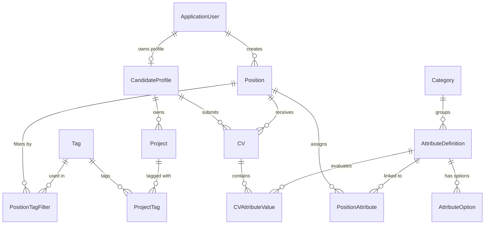

# Talent Management &amp; Recruitment System (TMRS)

A complete, production-quality, monolithic ASP.NET Core MVC web application built with C# and .NET 10, Entity Framework Core, and Microsoft SQL Server. The system features an extensible dynamic attribute engine, optimistic concurrency protection, strict monochrome design language, and role-based access control for Recruiters and Candidates.

---

## 1. Project Overview

The **Talent Management & Recruitment System** is an end-to-end web platform designed to streamline corporate hiring and candidate evaluation.

### Core Problems Solved
1. **Dynamic Technical Qualifications**: Instead of hardcoding technical attributes (e.g., GPA, Python, English Level, CAP) into relational tables with migration-heavy schema changes, the system provides a generic, decoupled attribute system. Recruiters define attributes dynamically at runtime, assign them to positions, and configure completion requirements.
2. **Historical Data Integrity**: When attributes are renamed or newly introduced to an existing position, prior candidate CV submissions remain intact without schema breakage or database errors (displaying "Empty / Not provided" for newly added attributes).
3. **Optimistic Concurrency**: Prevents race conditions and silent overwrites when multiple recruiters or candidates edit positions, attributes, projects, or applications simultaneously using SQL Server `rowversion` tokens.
4. **Monochrome Design Philosophy**: Adheres strictly to a minimalist, high-contrast black/white/grayscale aesthetic without distracting colorful elements or gradients.

---

## 2. Technology Stack

* **Language**: C# 13 / .NET 10
* **Web Framework**: ASP.NET Core MVC (.NET 10)
* **ORM**: Entity Framework Core 10 (Code First with SQL Server Provider)
* **Database**: Microsoft SQL Server (LocalDB `(localdb)\mssqllocaldb` / SQLEXPRESS / Azure SQL)
* **Authentication & Authorization**: ASP.NET Core Identity with role-based policies
* **Styling & UI**: Bootstrap 5 + Custom Strict Monochrome Stylesheet (`site.css`)
* **Image / File Storage**: Pluggable storage abstraction (`IFileStorageService`) with Cloudinary and local disk fallback (`wwwroot/uploads`)
* **Testing Framework**: xUnit with EF Core In-Memory database provider

---

## 3. Architecture

The application adopts a clean, understandable layered architecture:

```text
Presentation Layer (Razor Views + ViewModels)
       ↓
Controller Layer (HTTP handling, Model Validation, Anti-Forgery Tokens, Role Authorization)
       ↓
Service Layer (Business rules, Dynamic Attribute mapping, Concurrency checks, Storage operations)
       ↓
Data Layer (EF Core ApplicationDbContext, Migrations, Fluent API configurations, Seed Initializer)
       ↓
Relational Database (Microsoft SQL Server)
```

### Key Architectural Decisions
* **Strict Separation of Concerns**: Controllers only handle requests, validate inputs, invoke services, and return views. Business validation and mapping reside in the Service Layer.
* **View Model Decoupling**: Database entities are never exposed directly to input forms; strongly-typed ViewModels are used throughout.
* **Independence of Attributes**: Dynamic attributes are generic and completely decoupled from one another (no artificial hardcoded dependencies between skills).
* **Defensive Concurrency Trapping**: Concurrency conflicts trap `DbUpdateConcurrencyException`, preserving user-entered input while offering clear reload options.

---

## 4. Database Overview & Entity-Relationship Model



### Entities & Concurrency Tracking
* `ApplicationUser`: Extends `IdentityUser`.
* `CandidateProfile`: Candidate contact information, bio, profile photo URL/PublicId, and `RowVersion` token.
* `Category`: Lookup grouping values (e.g., General Information, Technical Skills, Education, Soft Skills). Lookup only; no UI CRUD.
* `AttributeDefinition`: Generic dynamic attribute with `AttributeType` (String, Number, Boolean, Dropdown), `CategoryId`, and `RowVersion` token.
* `AttributeOption`: Dropdown choices with `DisplayOrder` for Dropdown attributes.
* `Position`: Job position title, description, `Status` (Active/Closed), `MaxRecentProjects`, recruiter foreign key, and `RowVersion` token.
* `PositionAttribute`: Many-to-many junction between `Position` and `AttributeDefinition` with `IsRequired` and `DisplayOrder`.
* `Tag`: Reusable skill/technology tag. Unique index on `Name`.
* `PositionTagFilter`: Tag filter definitions for positions.
* `Project`: Candidate portfolio project with start/end dates, description, and `RowVersion` token.
* `ProjectTag`: Many-to-many junction between candidate projects and tags.
* `CV`: Candidate application for a position with `Status` (Draft or Published) and `RowVersion` token.
* `CVAttributeValue`: Dynamic candidate value linked to an `AttributeDefinition` and `CV` with `RowVersion` token.

---

## 5. Setup Instructions

### Prerequisites
* [.NET 10 SDK](https://dotnet.microsoft.com/download/dotnet/10.0) (SDK `10.0.401` or later)
* Microsoft SQL Server (LocalDB or SQLEXPRESS installed and running)
* Windows 10/11, macOS, or Linux

### Clone & Restore
```bash
git clone https://github.com/aminaminul/Talent-Management-Recruitment-System.git
cd TalentManagementRecruitmentSystem
dotnet restore
```

---

## 6. SQL Server Configuration

Configure your connection string in `src/TalentManagement/appsettings.json`:

```json
{
  "ConnectionStrings": {
    "DefaultConnection": "Server=(localdb)\\MSSQLLocalDB;Database=TalentManagementDb;Trusted_Connection=True;MultipleActiveResultSets=true;TrustServerCertificate=True"
  }
}
```

Ensure SQL LocalDB is running:
```powershell
sqllocaldb start MSSQLLocalDB
```

---

## 7. Migration Commands

The project includes pre-compiled EF Core Code First migrations. Migrations run automatically on application startup via `DbInitializer.SeedAsync()`.

To manually apply or inspect migrations using EF Core tools:
```powershell
dotnet tool restore
dotnet dotnet-ef database update --project src/TalentManagement/TalentManagement.csproj
```

To create a new migration in the future:
```powershell
dotnet dotnet-ef migrations add <MigrationName> --project src/TalentManagement/TalentManagement.csproj
```

---

## 8. Seed Data

On application startup, `DbInitializer` automatically checks and seeds:
1. **Identity Roles**: `Recruiter`, `Candidate`.
2. **Categories**: "General Information", "Technical Skills", "Soft Skills", "Education & Certifications", "Experience".
3. **Default Accounts**: Pre-configured recruiter and candidates.
4. **Dynamic Attributes**:
   * "English Level" (Dropdown: None, Basic, Intermediate, Fluent, Native)
   * "GPA" (Number)
   * "Python" (Boolean)
   * "Apache Hadoop" (Boolean)
   * "CAP" (Dropdown: None, Essentials, Pro, Expert)
   * "Person Age" (Number)
   * "Person Name" (String)
5. **Sample Tags**: "SQL", "R", "Python", "Machine Learning", "Data Analysis".
6. **Sample Position**: "Junior Data Engineer @ Acme Corp." with configured attributes (English Level, GPA [Required], Python, Hadoop, CAP [Required]), Tag filters ("SQL", "R", "Python"), and `MaxRecentProjects = 4`.
7. **Sample Projects**: Machine learning and analytics projects with tags for Candidate 1.

---

## 9. Default Development Accounts

| Role | Email | Password | Full Name |
| :--- | :--- | :--- | :--- |
| **Recruiter** | `recruiter@talent.local` | `Recruiter123!` | Aminul Islam |
| **Candidate 1** | `candidate1@talent.local` | `Candidate123!` | Rakib Hasan |
| **Candidate 2** | `candidate2@talent.local` | `Candidate123!` | Naem Ahmed |

---

## 10. Cloud Image-Storage Configuration

Uploaded images are never stored as Base64 strings or database BLOBs. The application uses the `IFileStorageService` abstraction:

* **Local Storage (Default Fallback)**: Automatically active when Cloudinary is not configured. Saves images to `wwwroot/uploads/profiles/` and generates safe, unique public identifiers.
* **Cloudinary (Optional Cloud Provider)**: To enable cloud image storage, configure user secrets or `appsettings.json`:

```json
"Cloudinary": {
  "CloudName": "your-cloud-name",
  "ApiKey": "your-api-key",
  "ApiSecret": "your-api-secret"
}
```

The database stores only `ProfileImageUrl` and `ImagePublicId`. Deleting an image cleans up the storage reference before updating the database.

---

## 11. Running the Project

```powershell
dotnet run --project src/TalentManagement/TalentManagement.csproj
```

Navigate to:
* **HTTP**: `http://localhost:5000`
* **HTTPS**: `https://localhost:5001`

> [!NOTE]
> On Windows 11 systems where **Smart App Control (SAC)** is enabled in Enforcement mode, unsigned locally compiled assemblies may be intercepted (error `0x800711C7`). To run development binaries smoothly, enable Developer Mode in **Windows Settings > System > For developers** or toggle Smart App Control to Evaluation/Off in **Windows Security > App & browser control**.

---

## 12. Testing Instructions

The solution includes a test suite covering dynamic attributes, workflows, cascade deletion, and concurrency.

To build and run tests:
```powershell
dotnet build tests/TalentManagement.Tests/TalentManagement.Tests.csproj
dotnet test tests/TalentManagement.Tests/TalentManagement.Tests.csproj
```

### Verified Test Suites
1. `DynamicAttributeTests`:
   * Creating generic, independent attributes of types String, Number, Boolean, and Dropdown.
   * **Requirement 61 Historical Scenario Verification**:
     - Recruiter creates "Person Age" & "Person Name".
     - Recruiter creates Position "Generic Employee" and assigns both attributes.
     - Candidate A creates CV (Age = 21, Name = Mary).
     - Candidate B creates CV (Age = 32, Name = John).
     - Recruiter renames "Person Age" -> "Finger Amount".
     - Recruiter adds new Attribute "Address".
     - Candidate C creates new CV (Finger Amount = 10, Person Name = Ellen, Address = Frisco).
     - Open Candidate A's old CV: verifies it loads without error displaying:
       - `Finger Amount: 21`
       - `Person Name: Mary`
       - `Address: Empty / Not provided`
2. `ConcurrencyTests`:
   * Asserts `DbUpdateConcurrencyException` when a stale `RowVersion` token is submitted on an update.
   * Asserts `DbUpdateConcurrencyException` when a stale `RowVersion` token is submitted on a delete.
3. `CvWorkflowTests`:
   * Verifies that saving as **Draft** succeeds even when required attributes are incomplete.
   * Verifies that **Publishing** fails with actionable validation errors if any required attribute is missing.
   * Verifies that **Publishing** succeeds once all required attributes are provided.
4. `CascadeDeleteTests`:
   * Verifies that deleting a position cascade-deletes position attributes and tag filters without deleting globally shared attributes or tags.
   * Verifies that attributes referenced by active positions or candidate CVs cannot be deleted (referential integrity protection).

---

## 13. Optimistic Concurrency Explanation

### Why Optimistic Concurrency?
Pessimistic locking (`LockedBy`, `LockedAt`) leaves database rows locked during idle user sessions, causing deadlocks and scalability bottlenecks. The system uses **Optimistic Concurrency** via SQL Server `rowversion` (`byte[]`).

### Workflow
1. When a user requests an edit form for a `Position`, `Attribute`, `Project`, or `CV`, the current `RowVersion` is transmitted in a hidden input.
2. If another user saves modifications in the meantime, the database automatically increments the `rowversion` column.
3. When the first user submits their changes, EF Core includes the original `rowversion` in the SQL `UPDATE ... WHERE Id = @id AND RowVersion = @originalRowVersion`.
4. If the rowversion does not match, EF Core raises a `DbUpdateConcurrencyException`.
5. The application catches this exception and displays a clean monochrome alert:
   > *"Someone else modified this record while it was being edited. Your changes were not saved."*
   alongside `[Reload Latest Version]` and `[Cancel]` buttons, preserving the user's entered form values.

---

## 14. Dynamic Attribute Engine Explanation

Attributes are generic descriptors stored in `AttributeDefinitions` and grouped by `Categories`.

```text
CV
 └── CVAttributeValue (CVId, AttributeDefinitionId, Value, RowVersion)
         │
         └── AttributeDefinition (Id, Name, AttributeType, CategoryId)
                 └── AttributeOptions (Value, DisplayOrder)
```

### Key Principles
1. **No Schema Alterations**: Adding a new qualification (e.g., "Kubernetes", "AWS Certified", "Speaking Spanish") does not add columns to the `Candidates` or `CVs` table.
2. **Non-Assumptive Engine**: The system does not assume semantic meaning from attribute names (no hardcoded `if (name == "GPA")`).
3. **Dynamic Form Rendering**:
   * `String` &rarr; `<input type="text" />`
   * `Number` &rarr; `<input type="number" step="any" />`
   * `Boolean` &rarr; `<input type="checkbox" />`
   * `Dropdown` &rarr; `<select>` populated from `AttributeOptions`
4. **Draft vs. Publish Validation**: Candidates can save an in-progress draft with missing values. Attempting to publish triggers server-side validation against all `PositionAttributes` marked `IsRequired == true`.

---

## 15. Cascade Deletion & Referential Integrity

The database strictly enforces referential integrity through foreign keys and configured delete behaviors:

* **Cascade Deletes**:
  - `Position` &rarr; `PositionAttributes` (Cascade: deleting a position cleans up its attribute assignments)
  - `Position` &rarr; `PositionTagFilters` (Cascade: deleting a position cleans up its filter associations)
  - `Position` &rarr; `CVs` (Cascade: deleting a position cleans up associated CVs)
  - `CV` &rarr; `CVAttributeValues` (Cascade: deleting a CV cleans up its dynamic values)
  - `CandidateProfile` &rarr; `Projects` (Cascade: deleting a candidate cleans up their projects)
  - `CandidateProfile` &rarr; `CVs` (Cascade: deleting a candidate cleans up their submitted CVs)
  - `Project` &rarr; `ProjectTags` (Cascade: deleting a project cleans up its tag links)
  - `AttributeDefinition` &rarr; `AttributeOptions` (Cascade: deleting an attribute cleans up its options)
* **Restrict / Safe Guards**:
  - `AttributeDefinition` &rarr; `PositionAttributes` (**Restrict**: a shared attribute cannot be deleted if assigned to any active position)
  - `AttributeDefinition` &rarr; `CVAttributeValues` (**Restrict**: a shared attribute cannot be deleted if recorded in any candidate CV)
  - `Tag` &rarr; `PositionTagFilters` / `ProjectTags` (**Restrict**: tags remain reusable globally)
  - Deleting a `Position` never deletes the underlying globally shared `AttributeDefinition` or `Tag`.

---

## 16. Monochrome UI Guidelines

The interface strictly adheres to a high-contrast monochrome design system:
* **Backgrounds**: Pure white (`#ffffff`) for pages; light gray (`#f4f4f4`, `#fafafa`) for cards and table headers.
* **Buttons**: Solid black (`#111111`) with white text for primary actions; outline borders (`#111111`) for secondary actions.
* **Borders & Separators**: Subtle grayscale borders (`#cccccc`, `#e5e5e5`).
* **Text**: Charcoal / pure black (`#111111`) for maximum readability and accessibility.
* **No Colorful Elements**: No blues, reds, greens, yellows, purples, or colorful icons. Alerts and badges use monochrome contrasts and explicit text labels (e.g. `[SUCCESS]`, `[NOTICE]`, `[REQUIRED]`).

---

## 17. License

This course project is released under the MIT License.